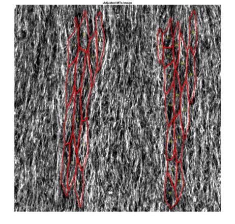

# Cytoskeleton

This is a script to analyse cytoskeleton organisation in 2D images

## Input data

The following three sub-folders within a single directory need to be present:
1. **borders** with the 8-bit tif images of cell outlines (e.g. E-cadherin staining) segmented in Packing Analyser. Each image will have a subfoder with the same name, that need to contain "tracked_bd.png" mask.

1. **cytoskeleton** with the corresponding tif projections (we use maximum projection in this case), which will be analysed for alignminet of cytoskeleton fibers within cells.

1. **cytoskeleton_average** with the corresponding tif projections (we use average projection in this case), which will be analysed for density and uniformity of cytoskeleton organisation.

Images should be numbered, but the numbers do not have to be sequencial, and the names might contain additional information. The numbers in image names will be used in the output files.

## Running the script
1. Start **actin_automatic_v1.m** script.

1. Select a folder with input data.

1. Select the parameters you would like to analyse: alignment of cytoskeleton (*MTSD*) or cytoskeleton distribution (*Density*).

1. In case you select density, choose the threshold method: Otsu's method with a threshold calculated on an adjusted image (*Otsu*), or calculating a threshold from intensity of edges detected in an image (*Edges*).

## Output

The following folders will be automatically created depending on the selection at the start of a run.
1. **distribution** with cell-by-cell signal direction distributions for each image (* **image number**_distribution.csv*) in case *MTSD* option for analysis is selected.

1. **images_analysed** with adjusted images of cytoskeleton, projection of a cell mask on them and numbers of each analysed cell.

1. **summary** with the summarysed data.
